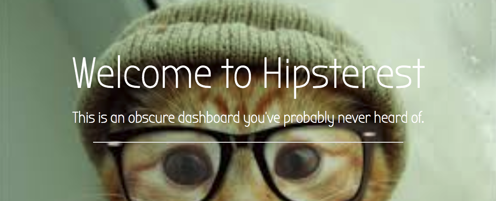

# Hipster-Dashboard

<p align='center'>
    </img>
</p>

# [Live Demo](https://greasy-current.surge.sh)


## Overview:
Given the time restrictions of the assignment, our group decided to create a dashboard of stand-alone components crafted individually and bound collectively in one place.  Although a robust React application in total, we focused on the basic principles of the library.


## Built by:

[Beth D'Amato](https://github.com/badamato)  
Contributions: Pomodoro Component, Trello Project Board, README.md

[Lisa Dean](https://github.com/lisadean)  
Contributions: Project Randomizer Component, README.md

[Aylin DeBruyne](https://github.com/adebruyne)  
Contributions: Weather Component, Main Dashboard Styling, README.md

[Delia Sanders](https://github.com/Dsande41)  
Contributions: Movie Component, README.md


## Built with:

* React.js
* Bootstrap/CSS
* Node.js
* Third-Party API's


## Project Whiteboarding

<p align='center'>
    </img>
</p>


## Obstacles and Breakthroughs

*The Pomodoro (Beth) -*
Getting my head around how to set the base time of my application and then work the knowledge of increment/decrement them in sync.  I confess, I had to consult multiple resources to understand logic blocks like those below.  I spent an hour or two remembering to 'parseInt' my add methods (thank you Zac Braddy for that, https://zackerthehacker.com/).

```
    handleChange(ev) {
        const newBaseTime = this.props.baseTime;
    
        if (ev.target.id === 'hours') newBaseTime.subtract(newBaseTime.get('hour'), 
        'hours').add(parseInt(ev.target.value, 10), 'hours');
        
        if (ev.target.id === 'minutes') newBaseTime.subtract(newBaseTime.get('minutes'),
        'minutes').add(parseInt(ev.target.value, 10), 'minutes');
        
        if (ev.target.id === 'seconds') newBaseTime.subtract(newBaseTime.get('seconds'),
        'seconds').add(parseInt(ev.target.value, 10), 'seconds');
    
        this.props.setBaseTime(newBaseTime);
    }
```

*Random Project Idea (Lisa) -*
My component was deliberately very simple. The only struggle I had with it was understanding how to work the JavaScript logic into the React component. I initially tried to include it inside the render method but realized quickly that using helper methods was much easier and cleaner.
```
makeLink = () => {
    if(this.props.source.url) {
      return (
        <p className="project-source">
          Source:&nbsp;
          <a href={this.props.source.url}>
            {this.props.source.name}
          </a>
        </p>
      )
    }
}

render () {

    return (
      <div className="project-container">
        <p className="project-description">
          {this.props.description}
        </p>
          {this.makeLink()}
      </div>
    );
}
```

*Hipsters Liked the Weather before it was cool(Weather Component by Aylin) -*
I wanted to have fun with the “hipster” theme, so, I thought about how to bring in some funny-hipster images with this mini-project. I took on the task of building a weather forecast component that would bring up a different hipsters depending on the weather description(i.e. cloudy= punk rock or sunny=beards with flowers). The biggest challenge was building a helper function to get data from the Google API and plug in the results into the Dark Sky API. Once I worked through step by step and broke the steps down, it made a lot more sense.
```
//helper function to get data
  _getData = input => {
    console.log("about to fetch lat and long");
    fetch(this._formattedGeocodeUrl(input), {
      method: "get"
    })
      .then(response => {
        console.log("got the geocode");
        // console.log(response.json());
        return response.json();
      })
      .then(data => {
        console.log(data);
        let location = data.results[0].formatted_address;
        this.setState({ locationData: location });
        let lat = data.results[0].geometry.location.lat;
        let lng = data.results[0].geometry.location.lng;
        return fetch(this._formattedWeatherUrl(lat, lng), {
          method: "get"
        });
      })
      .then(weather_response => weather_response.json())
      .then(weather_data => {
        console.log(weather_data);
        this.setState({ weatherData: weather_data });
      });
  };

```

*Movie search engine (Delia) -*
My component is fetching information from the omdbapi. The user searches the name of the movie and the application offers all the matching names for the search. Instead of displaying the movie images in a grid format, I used react Coverflow that enables the movies to be displayed in a carousel. 
```

  searchMovies =()=>{
     fetch(`http://www.omdbapi.com/?s=${this.state.query}&apikey=bd23d0c5`)
        .then(movies=>{
           return  movies.json();
        })
        .then(movies=>{
            console.log(movies.Search);
            this.setState({
                movies: movies.Search
            })

        })

  }
```


## License 
*Copyright 2018 Beth D'Amato, Lisa Dean, Aylin DeBruyne, Delia Sanders*

THE SOFTWARE IS PROVIDED "AS IS", WITHOUT WARRANTY OF ANY KIND, EXPRESS OR IMPLIED, INCLUDING BUT NOT LIMITED TO THE WARRANTIES OF MERCHANTABILITY, FITNESS FOR A PARTICULAR PURPOSE AND NONINFRINGEMENT. IN NO EVENT SHALL THE AUTHORS OR COPYRIGHT HOLDERS BE LIABLE FOR ANY CLAIM, DAMAGES OR OTHER LIABILITY, WHETHER IN AN ACTION OF CONTRACT, TORT OR OTHERWISE, ARISING FROM, OUT OF OR IN CONNECTION WITH THE SOFTWARE OR THE USE OR OTHER DEALINGS IN THE SOFTWARE.
